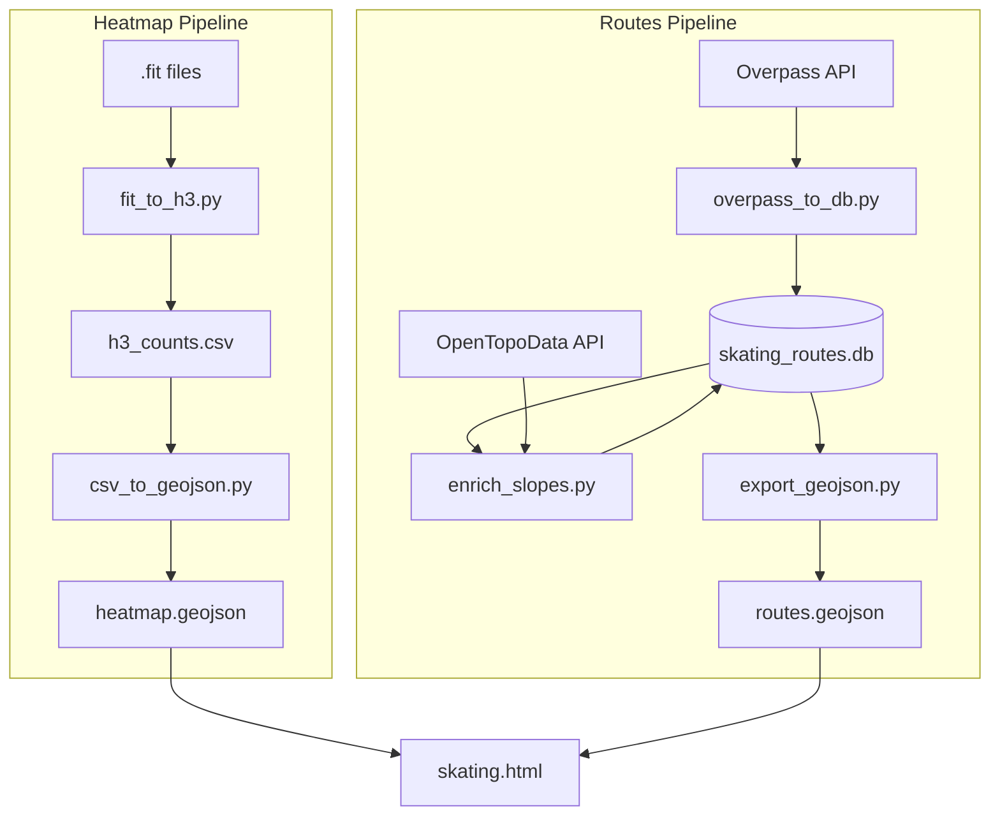

# Skating Map Pipeline

## Overview

Two data pipelines feed the skating map:
1. **Heatmap** — personal GPS tracks → H3 hexagon frequency visualization
2. **Routes** — OSM ways → skating-friendly routes with slope data



## Heatmap Pipeline

| Step | Script | Description |
|------|--------|-------------|
| 1 | `fit_to_h3.py` | Parse GPS points from .fit files, optionally densify tracks, convert to H3 cells, count visits per cell |
| 2 | `csv_to_geojson.py` | Convert H3 cell counts to GeoJSON hexagon polygons |
| 3 | `generate_heatmap.py` | Orchestrates steps 1-2 in one command |

## Routes Pipeline

| Step | Script | Description |
|------|--------|-------------|
| 1 | `overpass_to_db.py` | Fetch skating-friendly ways from OSM, store in SQLite |
| 2 | `enrich_slopes.py` | Sample elevations from EU-DEM, compute max/min slopes per way |
| 3 | `export_geojson.py` | Export ways with slope data to GeoJSON |

## Quick Start

```bash
# Generate heatmap from GPS tracks
generate-heatmap /path/to/fits -d 5 --min-count 3 -o heatmap.geojson

# Fetch routes and enrich with slopes
python overpass_to_db.py --query-file queries/smooth.overpassql --type smooth
python enrich_slopes.py
python export_geojson.py -o routes.geojson
```